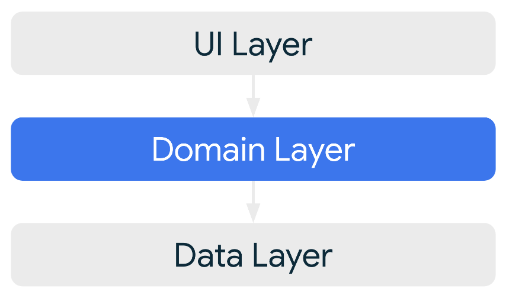

# wanted_preonboarding_android
## 팀 이름
학연지연우연인연

## App Architecture


Android Developers에서 권장하는 앱 아키텍처 가이드를 따랐습니다.
* 관심사 분리 원칙에 따라 View(Activity/Fragment)에서는 UI와 클릭 이벤트와 같은 상호작용에 대한 처리를 진행하고, 그 외 View에서 처리하지 않아도 되는 로직들은 분리하였습니다.

---

### UI Layer


UI Layer는 화면에 UI를 표시하는 역할과 사용자의 상호작용을 담당합니다. 

---

### Domain Layer


Domain Layer는 ViewModel에서 사용되는 앱 비지니스 로직의 캡슐화된 클래스가 포함됩니다.

---

### Data Layer


Data Layer는 네트워크 작업 또는 데이터베이스 작업과 같은 데이터와 관련한 앱의 비지니스 로직이 포함됩니다. 


## Package Structure
```
├── data
│   ├── datasource
│   │   ├── local
│   │   ├── remote
│   │   └── source
│   ├── db
│   ├── mapper
│   ├── model
│   ├── network
│   └── repository
├── di
├── domain
│   ├── model
│   ├── repository
│   └── usecase
├── ui
│   ├── category
│   │   └── adapter
│   ├── common
│   │   └── base
│   ├── news
│   ├── newsdetail
│   └── save
└── util
```

## Library
|Architecture|Android App Architecture + AAC-ViewModel|
|---|---|
|DI|Koin|
|Network|OkHttp3, Retrofit2|
|Asynchronous Processing|Coroutine, Flow|
|Jetpack|Navigation, Room, Lifecycle, ViewModel, DataBinding|
|Third-Party|Timber, Glide, Gson|

<br>


## Simulation

https://user-images.githubusercontent.com/51078673/189527346-c479e78c-b410-48cd-9dca-4e4668912284.mov
